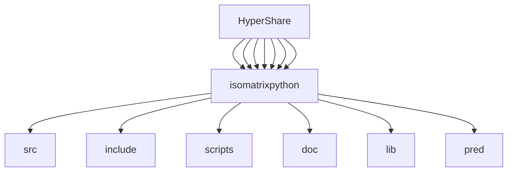

[+] build:
```
cd isomatrixpython
mkdir build && cd build &&  cmake ../
make -j8 all
cp ../test.py .
#test python:
python3 ./test.py
#run unit tests: 

./isolation_mat_python_test
```

Successful execution will display the graph above once it's done 


